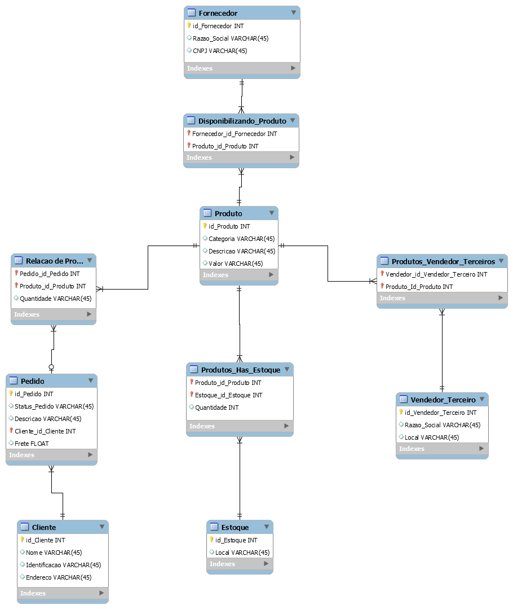
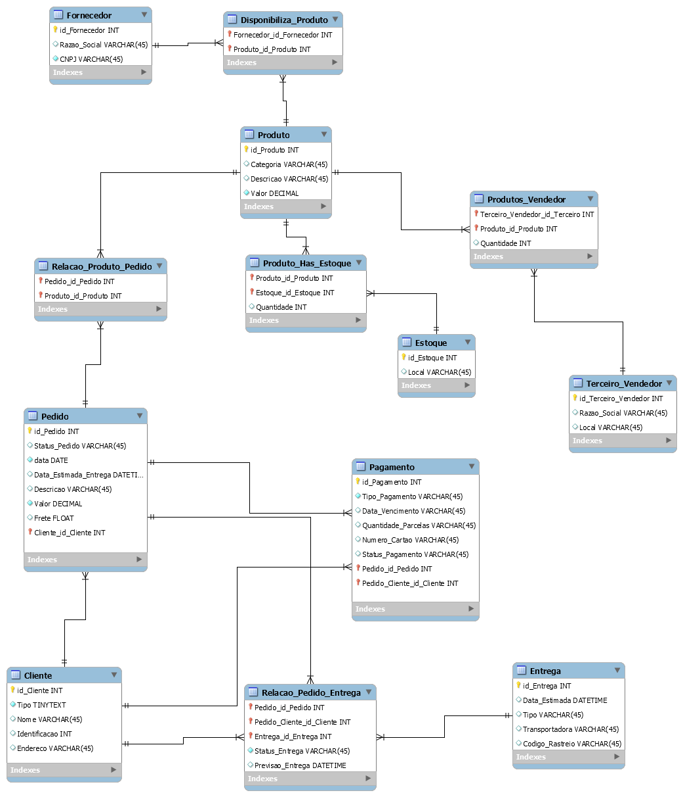

# Desafio 01: Refinando a Modelagem do Cenário E-commerce

## Descrição do Desafio

Neste desafio, o objetivo é **refinar a modelagem** do cenário de e-commerce, considerando as seguintes **entidades e suas relações:**

* **Cliente:**
  * **PJ** (Pessoa Jurídica)
  * **PF** (Pessoa Física)
  * **Pagamentos:** Um cliente pode ter múltiplas formas de pagamento cadastradas.
  * **Entregas:** Possui status e código de rastreio.

## Diagrama de Entidade-Relacionamento Estendido (EER)

Diagrama construído na ferramenta MySQL WorkBench

**A modelagem pode ser realizada em diversos aplicações, exemplo:** 

* **MySQL WorkBench** Ferramenta utilizada pela Juliana durante as aulas
* **Draw.io:**
* **dbdesigner.net**

## Considerações e Decisões de Modelagem

* **Herança:** Uma possível abordagem é utilizar herança para representar os tipos de clientes (PJ e PF).
* **Tabelas:** As entidades Pagamento e Entrega podem ser tabelas relacionadas à entidade Cliente através de uma chave estrangeira.
* **Normalização:** Certifique-se de que o modelo esteja normalizado para evitar redundâncias e inconsistências.

## Resolução do Desafio

